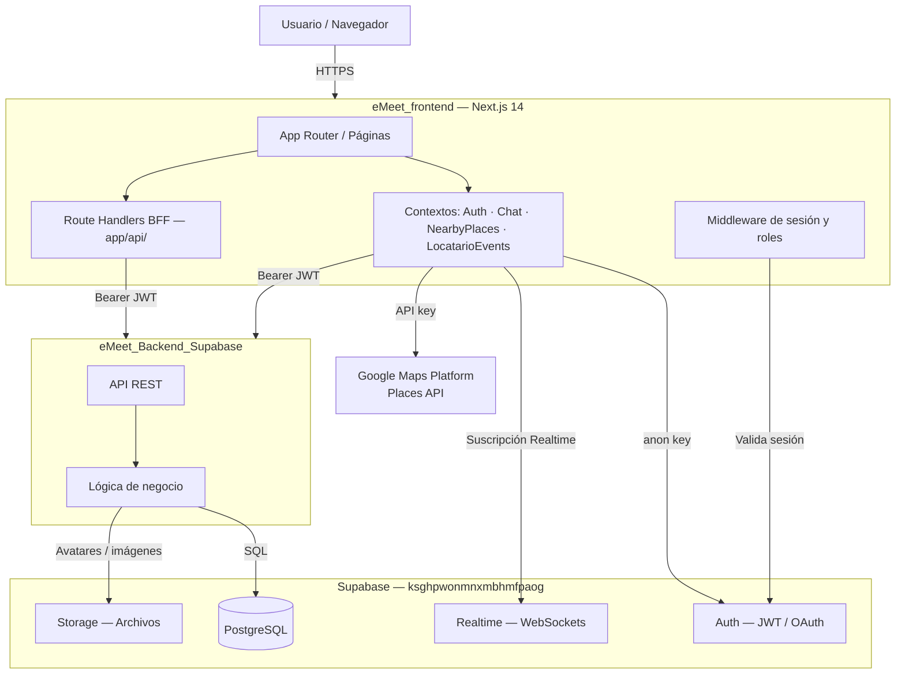

# Arquitectura del Sistema eMeet

---

## 1. Tipo de Arquitectura

El sistema eMeet adopta una arquitectura de **tres capas con BFF (Backend For Frontend)**, combinando elementos de arquitectura orientada a microservicios lógicos:

- **Capa de Presentación**: frontend Next.js 14 App Router con componentes React.
- **Capa de Lógica de Negocio / BFF**: Route Handlers y Server Actions dentro de Next.js, que actúan como intermediarios seguros entre el frontend y los servicios externos.
- **Capa de Datos**: Supabase PostgreSQL, gestionada en parte directamente por el frontend (cliente Supabase) y en parte por el backend `eMeet_Backend_Supabase`.

---

## 2. Componentes del Sistema

### 2.1 Frontend — `eMeet_frontend`

| Componente | Tecnología | Descripción |
|---|---|---|
| App Router | Next.js 14 | Sistema de rutas basado en carpetas `app/` |
| UI | React 18 + TypeScript 5.6 | Componentes declarativos con tipado estricto |
| Estilos | Tailwind CSS 3.4 | Utilidades CSS, mobile-first |
| Animaciones | Framer Motion 11 | Swipe gestural, transiciones |
| Iconos | React Icons 5 + Lucide React | Iconografía SVG |
| Gráficos | Recharts 3.8 | Visualizaciones para el panel admin |
| Carga de progreso | nextjs-toploader | Indicador de carga en navegación |

### 2.2 Backend — `eMeet_Backend_Supabase`

> ⏳ **Pendiente por validar**: El repositorio `eMeet_Backend_Supabase` no estuvo disponible para análisis directo. La siguiente información se infiere desde las llamadas del frontend.

El backend expone endpoints REST que son consumidos por el frontend a través de la variable de entorno `NEXT_PUBLIC_BACKEND_URL`. Se identificaron los siguientes grupos de endpoints:

| Grupo | Endpoints detectados |
|---|---|
| Autenticación | `POST /auth/login`, `POST /auth/register`, `POST /auth/logout` |
| Perfil | `GET /profile`, `PATCH /profile` |
| Eventos de usuario | `GET /events/liked`, `GET /events/saved` |
| Chat | `GET /chat/rooms`, `POST /chat/rooms/:id/join`, `GET /chat/rooms/:id/messages`, `POST /chat/rooms/:id/messages`, `POST /chat/rooms/:id/read` |
| Locatario | `GET /events/locatario`, `POST /events/locatario`, `DELETE /events/locatario/:id` |
| Admin | `GET /admin/stats`, `GET /admin/reports`, `PATCH /admin/reports/:id` |

### 2.3 Supabase (plataforma backend)

| Servicio | Uso en el sistema |
|---|---|
| **Auth** | Registro, login, OAuth (Google/Apple), verificación de email, tokens JWT |
| **PostgreSQL** | Tablas: `profiles`, `user_events`, `chat_rooms`, `room_members`, `chat_messages`, `locatario_events` |
| **Realtime** | Suscripción a INSERT en `chat_messages` para chat en tiempo real |
| **Storage** | Imágenes de perfil y eventos (confirmado por hooks `useImageUpload`, `useVideoUpload`) |
| **SSR** | Cookie-based sessions con `@supabase/ssr` en middleware Next.js |

---

## 3. Capa de Presentación

La capa de presentación corresponde al repositorio `eMeet_frontend`. Es una aplicación web mobile-first construida con Next.js 14 App Router. El renderizado por defecto es Server Component; los Client Components se usan únicamente donde se requieren eventos del navegador, gestión de estado interactivo o APIs del cliente (como `navigator.geolocation` o WebSockets).

### Rutas principales detectadas:

| Ruta | Acceso | Descripción |
|---|---|---|
| `/` | Autenticado | Feed principal con swipe de lugares |
| `/auth` | Público | Login y registro |
| `/auth/callback` | Público | Callback para OAuth (Google/Apple) |
| `/auth/verify-email` | Público | Pantalla de verificación de email |
| `/search` | Autenticado | Búsqueda y exploración de lugares |
| `/saved` | Autenticado | Lista de lugares guardados |
| `/profile` | Autenticado | Perfil del usuario |
| `/chat` | Autenticado | Lista de salas de chat |
| `/chat/[roomId]` | Autenticado | Sala de chat individual |
| `/admin` | Solo `admin` | Dashboard de administración |
| `/admin/events` | Solo `admin` | Gestión de eventos |
| `/admin/users` | Solo `admin` | Gestión de usuarios |
| `/admin/moderation` | Solo `admin` | Moderación de contenido |
| `/admin/finance` | Solo `admin` | Finanzas y reportes |
| `/locatario` | Solo `locatario` | Panel de locatario |

---

## 4. Capa de Lógica de Negocio (BFF)

Los Route Handlers de Next.js (`app/api/`) actúan como una capa BFF que delega las solicitudes al backend externo `eMeet_Backend_Supabase`, añadiendo el encabezado `Authorization` desde la sesión del cliente.

### Route Handlers detectados:

```
app/api/
  admin/
    stats/route.ts          ← GET /admin/stats
    reports/route.ts        ← GET/POST /admin/reports
    reports/[id]/route.ts   ← PATCH /admin/reports/:id
    finance/route.ts        ← GET /admin/finance
  auth/
    callback/route.ts       ← Callback OAuth de Supabase
```

---

## 5. Capa de Datos

### 5.1 Tablas confirmadas en Supabase PostgreSQL

Las siguientes tablas fueron confirmadas directamente desde el archivo `src/lib/supabase.ts` (tipo `Database`):

#### Tabla `profiles`
| Campo | Tipo | Descripción |
|---|---|---|
| id | UUID | PK — igual al `auth.users.id` de Supabase |
| name | TEXT | Nombre del usuario |
| role | ENUM | `'user' \| 'locatario' \| 'admin'` |
| bio | TEXT | Descripción del usuario |
| avatar_url | TEXT (null) | URL del avatar |
| location | TEXT | Ciudad o ubicación del usuario |
| business_name | TEXT (null) | Nombre del negocio (solo locatarios) |
| business_location | TEXT (null) | Ubicación del negocio (solo locatarios) |
| interests | TEXT[] | Categorías de interés del usuario |
| created_at | TIMESTAMPTZ | Fecha de creación |

#### Tabla `user_events`
| Campo | Tipo | Descripción |
|---|---|---|
| id | UUID | PK |
| user_id | UUID | FK → profiles.id |
| event_id | TEXT | ID del lugar o evento |
| event_title | TEXT (null) | Título del evento |
| event_image_url | TEXT (null) | Imagen del evento |
| event_address | TEXT (null) | Dirección del evento |
| action | ENUM | `'like' \| 'save'` |
| created_at | TIMESTAMPTZ | Fecha de la acción |

#### Tabla `chat_rooms`
| Campo | Tipo | Descripción |
|---|---|---|
| id | TEXT | PK (igual al placeId del lugar) |
| event_title | TEXT | Nombre de la sala |
| event_image_url | TEXT (null) | Imagen del lugar |
| event_address | TEXT (null) | Dirección del lugar |
| created_at | TIMESTAMPTZ | Fecha de creación |

#### Tabla `room_members`
| Campo | Tipo | Descripción |
|---|---|---|
| room_id | TEXT | FK → chat_rooms.id |
| user_id | UUID | FK → profiles.id |
| joined_at | TIMESTAMPTZ | Fecha de ingreso |
| last_read_at | TIMESTAMPTZ | Última lectura |

#### Tabla `chat_messages`
| Campo | Tipo | Descripción |
|---|---|---|
| id | UUID | PK |
| room_id | TEXT | FK → chat_rooms.id |
| user_id | UUID | FK → profiles.id |
| text | TEXT | Contenido del mensaje |
| created_at | TIMESTAMPTZ | Fecha del mensaje |

#### Tabla `locatario_events`
| Campo | Tipo | Descripción |
|---|---|---|
| id | UUID | PK |
| creator_id | UUID | FK → profiles.id |
| title | TEXT | Título del evento |
| description | TEXT | Descripción |
| category | ENUM | Categoría del evento |
| event_date | TIMESTAMPTZ | Fecha del evento |
| address | TEXT | Dirección |
| price | NUMERIC (null) | Precio (null = gratis) |
| image_url | TEXT (null) | Imagen del evento |
| organizer_name | TEXT | Nombre del organizador |
| organizer_avatar | TEXT (null) | Avatar del organizador |
| created_at | TIMESTAMPTZ | Fecha de creación |

---

## 6. Contextos Globales del Frontend

| Contexto | Hook | Descripción |
|---|---|---|
| `AuthContext` | `useAuth()` | Estado global de autenticación, login, logout, registro, OAuth |
| `ChatContext` | `useChatContext()` | Salas de chat, mensajes, tiempo real, join/send/read |
| `NearbyPlacesContext` | `useNearbyPlacesContext()` | Lugares cercanos (Google Places), filtros, geolocalización |
| `LocatarioEventsContext` | `useLocatarioEvents()` | Eventos creados por locatarios, CRUD |

---

## 7. Variables de Entorno Necesarias

Las siguientes variables de entorno fueron identificadas directamente en el código fuente. **No se incluyen valores reales.**

| Variable | Visibilidad | Descripción |
|---|---|---|
| `NEXT_PUBLIC_SUPABASE_URL` | Cliente | URL del proyecto Supabase |
| `NEXT_PUBLIC_SUPABASE_ANON_KEY` | Cliente | Clave anónima de Supabase |
| `NEXT_PUBLIC_BACKEND_URL` | Cliente | URL base del backend `eMeet_Backend_Supabase` |
| `NEXT_PUBLIC_GOOGLE_MAPS_API_KEY` | Cliente | Clave de Google Maps JavaScript + Places API |
| `NEXT_PUBLIC_PLACES_TIMEOUT_MS` | Cliente | Timeout en ms para llamadas a Places API (opcional) |
| `SUPABASE_SERVICE_ROLE_KEY` | Solo servidor | Clave service role de Supabase (uso interno) |
| `BACKEND_FETCH_TIMEOUT_MS` | Solo servidor | Timeout para llamadas al backend desde Route Handlers |

> ⚠️ Las variables `NEXT_PUBLIC_*` son accesibles desde el navegador. Las demás solo deben usarse en el servidor.

---

## 8. Flujo de Datos

### Flujo de autenticación:
```
[Usuario] → /auth → [LoginForm]
→ fetchApi('/api/auth/login') → [eMeet_Backend_Supabase]
→ Recibe session (access_token + refresh_token)
→ supabase.auth.setSession(tokens)
→ syncUserData() → fetchApi('/api/profile') + '/api/events/liked' + '/api/events/saved'
→ AuthContext actualiza estado global
→ Redirect según rol (/admin, /locatario, /)
```

### Flujo del feed de lugares:
```
[NearbyPlacesContext] → navigator.geolocation → userLocation
→ useJsApiLoader (Google Maps JS API)
→ fetchNearby(bounds, placeTypes) → PlacesService → Google Places API
→ places[] → placeToEvent() (adaptador) → SwipeCard[]
→ [Usuario] swipe right/left → excludePlace / joinRoom
```

### Flujo del chat:
```
[Usuario] → /chat → [ChatContext]
→ fetchApi('/api/chat/rooms') → lista de salas
→ /chat/[roomId] → loadMessagesForRoom() → fetchApi('/api/chat/rooms/:id/messages')
→ Supabase Realtime (canal 'emeet-chat-realtime')
  → escucha INSERT en chat_messages
  → actualiza mensajes y sala en tiempo real
→ sendMessage() → fetchApi POST + update optimista
```

---

## 9. Integraciones Externas

| Integración | Tipo | Descripción |
|---|---|---|
| **Supabase** | Backend as a Service | Auth, DB, Realtime, Storage |
| **Google Maps Platform** | API externa | Maps JavaScript API + Places API |
| **eMeet_Backend_Supabase** | API REST propia | Lógica de negocio, validaciones, endpoints REST |
| **OAuth Google** | Proveedor de identidad | Login con cuenta Google |
| **OAuth Apple** | Proveedor de identidad | Login con Apple ID |

---

## 10. Diagrama Textual de Arquitectura (Mermaid)



---

## 11. Información Pendiente por Validar

| Elemento | Estado |
|---|---|
| Estructura interna de `eMeet_Backend_Supabase` | ⏳ Pendiente |
| Configuración de RLS en Supabase | ⏳ Pendiente |
| ORM utilizado en el backend (Prisma u otro) | ⏳ Pendiente |
| Esquema SQL completo (migraciones) | ⏳ Pendiente |
| URL pública de producción del sistema | ⏳ Pendiente |
| Configuración de CI/CD del backend | ⏳ Pendiente |
