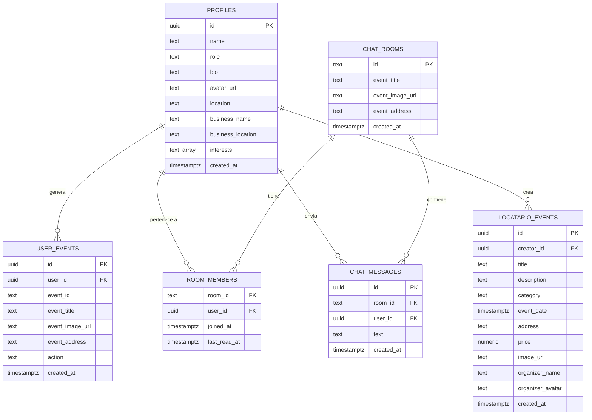

# Modelo Entidad-Relación (MER) — Proyecto eMeet

---

## 1. Consideraciones Previas

El frontend `eMeet_frontend` no contiene scripts SQL propios, pero el archivo `src/lib/supabase.ts` define el tipo `Database` de TypeScript, que documenta con precisión la estructura de tablas en Supabase PostgreSQL. Este MER está construido a partir de esa fuente.

Los datos de **lugares cercanos** provienen de **Google Places API** y no se almacenan de forma persistente en la base de datos del frontend (se obtienen dinámicamente). El documento `docs/backend_plan.md` propone una tabla `cached_places` para persistirlos en el backend.

> ⏳ **Pendiente por validar con `eMeet_Backend_Supabase` y Supabase**: esquema completo de migraciones SQL, índices, políticas RLS y tablas adicionales existentes en el backend.

---

## 2. Entidades y Atributos

### 2.1 `profiles` (Perfiles de usuario)

| Atributo | Tipo | Restricciones | Descripción |
|---|---|---|---|
| `id` | UUID | PK, FK → auth.users.id | Identificador único del usuario |
| `name` | TEXT | NOT NULL | Nombre del usuario |
| `role` | ENUM | NOT NULL, DEFAULT 'user' | `'user' \| 'locatario' \| 'admin'` |
| `bio` | TEXT | DEFAULT '' | Descripción personal |
| `avatar_url` | TEXT | NULL | URL de la foto de perfil |
| `location` | TEXT | DEFAULT '' | Ciudad o dirección del usuario |
| `business_name` | TEXT | NULL | Nombre del negocio (solo locatarios) |
| `business_location` | TEXT | NULL | Ubicación del negocio (solo locatarios) |
| `interests` | TEXT[] | DEFAULT '{}' | Categorías de interés del usuario |
| `created_at` | TIMESTAMPTZ | DEFAULT now() | Fecha de creación del perfil |

---

### 2.2 `user_events` (Acciones del usuario sobre eventos/lugares)

| Atributo | Tipo | Restricciones | Descripción |
|---|---|---|---|
| `id` | UUID | PK, DEFAULT gen_random_uuid() | Identificador único de la acción |
| `user_id` | UUID | FK → profiles.id | Usuario que realizó la acción |
| `event_id` | TEXT | NOT NULL | ID del evento o lugar (placeId) |
| `event_title` | TEXT | NULL | Título del evento o lugar |
| `event_image_url` | TEXT | NULL | URL de imagen |
| `event_address` | TEXT | NULL | Dirección del evento o lugar |
| `action` | ENUM | NOT NULL | `'like' \| 'save'` |
| `created_at` | TIMESTAMPTZ | DEFAULT now() | Fecha de la acción |

---

### 2.3 `chat_rooms` (Salas de chat comunitarias)

| Atributo | Tipo | Restricciones | Descripción |
|---|---|---|---|
| `id` | TEXT | PK | Igual al `placeId` del lugar asociado |
| `event_title` | TEXT | NOT NULL | Nombre del lugar/evento |
| `event_image_url` | TEXT | NULL | Imagen del lugar |
| `event_address` | TEXT | NULL | Dirección del lugar |
| `created_at` | TIMESTAMPTZ | DEFAULT now() | Fecha de creación de la sala |

---

### 2.4 `room_members` (Miembros de una sala de chat)

| Atributo | Tipo | Restricciones | Descripción |
|---|---|---|---|
| `room_id` | TEXT | PK (compuesto), FK → chat_rooms.id | Sala de chat |
| `user_id` | UUID | PK (compuesto), FK → profiles.id | Usuario miembro |
| `joined_at` | TIMESTAMPTZ | DEFAULT now() | Fecha de ingreso a la sala |
| `last_read_at` | TIMESTAMPTZ | DEFAULT now() | Última vez que el usuario leyó mensajes |

---

### 2.5 `chat_messages` (Mensajes de chat)

| Atributo | Tipo | Restricciones | Descripción |
|---|---|---|---|
| `id` | UUID | PK, DEFAULT gen_random_uuid() | Identificador único del mensaje |
| `room_id` | TEXT | NOT NULL, FK → chat_rooms.id | Sala a la que pertenece |
| `user_id` | UUID | DEFAULT auth.uid(), FK → profiles.id | Usuario remitente |
| `text` | TEXT | NOT NULL | Contenido del mensaje |
| `created_at` | TIMESTAMPTZ | DEFAULT now() | Fecha y hora del mensaje |

---

### 2.6 `locatario_events` (Eventos publicados por locatarios)

| Atributo | Tipo | Restricciones | Descripción |
|---|---|---|---|
| `id` | UUID | PK, DEFAULT gen_random_uuid() | Identificador único del evento |
| `creator_id` | UUID | DEFAULT auth.uid(), FK → profiles.id | Locatario creador del evento |
| `title` | TEXT | NOT NULL | Título del evento |
| `description` | TEXT | DEFAULT '' | Descripción detallada |
| `category` | ENUM | NOT NULL | Categoría del evento |
| `event_date` | TIMESTAMPTZ | NOT NULL | Fecha del evento |
| `address` | TEXT | DEFAULT '' | Dirección del evento |
| `price` | NUMERIC | NULL | Precio (null = gratis) |
| `image_url` | TEXT | NULL | URL de la imagen del evento |
| `organizer_name` | TEXT | DEFAULT '' | Nombre del organizador |
| `organizer_avatar` | TEXT | NULL | Avatar del organizador |
| `created_at` | TIMESTAMPTZ | DEFAULT now() | Fecha de publicación |

---

### 2.7 `cached_places` (Propuesta — desde `docs/backend_plan.md`)

> ⏳ Esta tabla es una **propuesta documentada** del equipo técnico. No está confirmada en el frontend. Requiere validación con `eMeet_Backend_Supabase`.

| Atributo | Tipo | Descripción |
|---|---|---|
| `place_id` | TEXT PK | ID de Google Places |
| `name` | TEXT | Nombre del lugar |
| `address` | TEXT | Dirección |
| `type` | TEXT | Tipo de lugar (restaurant, bar, etc.) |
| `latitude` | DOUBLE PRECISION | Coordenada latitud |
| `longitude` | DOUBLE PRECISION | Coordenada longitud |
| `rating` | NUMERIC | Calificación promedio |
| `photo_url` | TEXT | URL de foto |
| `website` | TEXT | Sitio web |
| `phone` | TEXT | Teléfono |
| `updated_at` | TIMESTAMPTZ | Última actualización |

---

## 3. Relaciones

| Relación | Tipo | Descripción |
|---|---|---|
| `profiles` ← `user_events` | 1:N | Un usuario puede tener muchas acciones sobre eventos |
| `profiles` ← `room_members` | 1:N | Un usuario puede ser miembro de muchas salas |
| `profiles` ← `chat_messages` | 1:N | Un usuario puede enviar muchos mensajes |
| `profiles` ← `locatario_events` | 1:N | Un locatario puede crear muchos eventos |
| `chat_rooms` ← `room_members` | 1:N | Una sala puede tener muchos miembros |
| `chat_rooms` ← `chat_messages` | 1:N | Una sala puede contener muchos mensajes |

---

## 4. Diagrama MER (Mermaid)

---

## 5. Supuestos y Consideraciones

| Supuesto | Justificación |
|---|---|
| El campo `profiles.id` es igual a `auth.users.id` de Supabase | Confirmado por el tipo `Insert.id` en `supabase.ts` |
| La tabla `user_events` almacena tanto likes como guardados | Confirmado por el campo `action: 'like' \| 'save'` |
| Las salas de chat (`chat_rooms.id`) usan el `placeId` de Google Places | Confirmado por `ChatContext` y el tipo `ChatRoom` en `types/index.ts` |
| Los campos `lat` y `lng` en `locatario_events` existen pero no están en el tipo Supabase | Inferido desde `LocatarioEventsContext.tsx` (campo `LocatarioEventRow`) |
| No existe tabla de notificaciones ni de pagos | No se detectaron en el código del frontend |

---

## 6. Relación con Supabase

- Todas las tablas documentadas residen en el proyecto Supabase: `https://supabase.com/dashboard/project/ksghpwonmnxmbhmfpaog`
- Supabase Auth gestiona la tabla `auth.users`, sobre la cual se construye `profiles` mediante FK.
- Supabase Realtime monitorea INSERT en `chat_messages` para actualizar el chat en tiempo real.
- Supabase Storage almacena avatares e imágenes de eventos (referenciados desde `avatar_url`, `image_url`, `event_image_url`).
- Las políticas RLS (Row Level Security) deben estar configuradas para garantizar que cada usuario solo acceda a sus propios datos. Su configuración exacta es **pendiente por validar**.

---

## 7. Información Pendiente por Validar

| Elemento | Estado |
|---|---|
| Esquema SQL completo con migraciones | ⏳ Pendiente — requiere acceso a `eMeet_Backend_Supabase` |
| Políticas RLS configuradas en Supabase | ⏳ Pendiente — requiere acceso al dashboard de Supabase |
| Índices de rendimiento en tablas de mayor volumen | ⏳ Pendiente |
| Existencia y estructura de tabla `cached_places` | ⏳ Pendiente — propuesta en `docs/backend_plan.md` |
| Campos `lat` y `lng` en `locatario_events` (no están en tipo Supabase) | ⏳ Pendiente de sincronización entre schema y tipos TypeScript |
