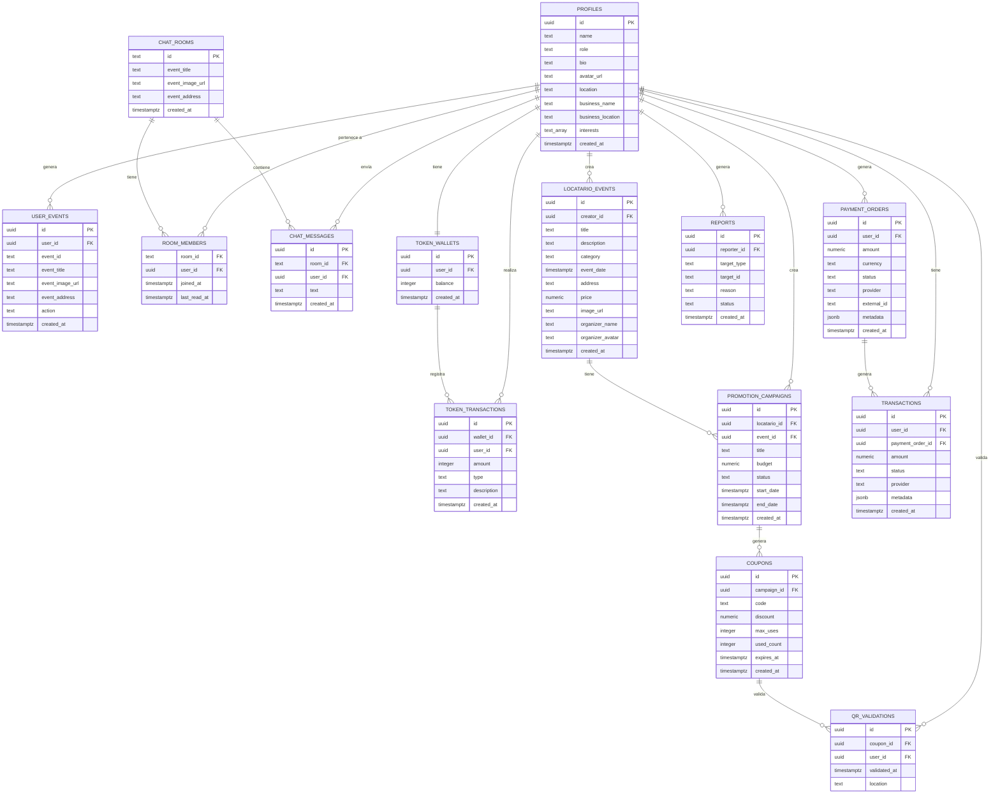

# Modelo Entidad-Relación (MER) — Proyecto eMeet

---

## 1. Consideraciones Previas

El esquema de base de datos de eMeet reside en el proyecto Supabase `ksghpwonmnxmbhmfpaog` y es administrado principalmente desde `eMeet_Backend_Supabase`. El frontend define tipos TypeScript en `src/lib/supabase.ts` que documentan las tablas del lado cliente; el backend define rutas y lógica de negocio sobre el mismo esquema PostgreSQL.

Los datos de **lugares cercanos** provienen de **Google Places API** y no se almacenan de forma persistente en Supabase (se obtienen dinámicamente). Los resultados se cachean en memoria durante la sesión del usuario a través de `NearbyPlacesContext`.

Este MER documenta las **14 entidades confirmadas** según el Informe EP2 del proyecto.

---

## 2. Entidades y Atributos

### 2.1 `profiles` (Perfiles de usuario)

| Atributo | Tipo | Restricciones | Descripción |
|---|---|---|---|
| `id` | UUID | PK, FK → auth.users.id | Identificador único del usuario |
| `name` | TEXT | NOT NULL | Nombre del usuario |
| `role` | ENUM | NOT NULL, DEFAULT 'user' | `'user' \| 'locatario' \| 'admin'` |
| `bio` | TEXT | DEFAULT '' | Descripción personal |
| `avatar_url` | TEXT | NULL | URL de la foto de perfil |
| `location` | TEXT | DEFAULT '' | Ciudad o dirección del usuario |
| `business_name` | TEXT | NULL | Nombre del negocio (solo locatarios) |
| `business_location` | TEXT | NULL | Ubicación del negocio (solo locatarios) |
| `interests` | TEXT[] | DEFAULT '{}' | Categorías de interés del usuario |
| `created_at` | TIMESTAMPTZ | DEFAULT now() | Fecha de creación del perfil |

---

### 2.2 `user_events` (Acciones del usuario sobre eventos/lugares)

| Atributo | Tipo | Restricciones | Descripción |
|---|---|---|---|
| `id` | UUID | PK, DEFAULT gen_random_uuid() | Identificador único de la acción |
| `user_id` | UUID | FK → profiles.id | Usuario que realizó la acción |
| `event_id` | TEXT | NOT NULL | ID del evento o lugar (placeId) |
| `event_title` | TEXT | NULL | Título del evento o lugar |
| `event_image_url` | TEXT | NULL | URL de imagen |
| `event_address` | TEXT | NULL | Dirección del evento o lugar |
| `action` | ENUM | NOT NULL | `'like' \| 'save'` |
| `created_at` | TIMESTAMPTZ | DEFAULT now() | Fecha de la acción |

---

### 2.3 `chat_rooms` (Salas de chat comunitarias)

| Atributo | Tipo | Restricciones | Descripción |
|---|---|---|---|
| `id` | TEXT | PK | Igual al `placeId` del lugar asociado |
| `event_title` | TEXT | NOT NULL | Nombre del lugar/evento |
| `event_image_url` | TEXT | NULL | Imagen del lugar |
| `event_address` | TEXT | NULL | Dirección del lugar |
| `created_at` | TIMESTAMPTZ | DEFAULT now() | Fecha de creación de la sala |

---

### 2.4 `room_members` (Miembros de una sala de chat)

| Atributo | Tipo | Restricciones | Descripción |
|---|---|---|---|
| `room_id` | TEXT | PK (compuesto), FK → chat_rooms.id | Sala de chat |
| `user_id` | UUID | PK (compuesto), FK → profiles.id | Usuario miembro |
| `joined_at` | TIMESTAMPTZ | DEFAULT now() | Fecha de ingreso a la sala |
| `last_read_at` | TIMESTAMPTZ | DEFAULT now() | Última vez que el usuario leyó mensajes |

---

### 2.5 `chat_messages` (Mensajes de chat)

| Atributo | Tipo | Restricciones | Descripción |
|---|---|---|---|
| `id` | UUID | PK, DEFAULT gen_random_uuid() | Identificador único del mensaje |
| `room_id` | TEXT | NOT NULL, FK → chat_rooms.id | Sala a la que pertenece |
| `user_id` | UUID | DEFAULT auth.uid(), FK → profiles.id | Usuario remitente |
| `text` | TEXT | NOT NULL | Contenido del mensaje |
| `created_at` | TIMESTAMPTZ | DEFAULT now() | Fecha y hora del mensaje |

---

### 2.6 `locatario_events` (Eventos publicados por locatarios)

| Atributo | Tipo | Restricciones | Descripción |
|---|---|---|---|
| `id` | UUID | PK, DEFAULT gen_random_uuid() | Identificador único del evento |
| `creator_id` | UUID | DEFAULT auth.uid(), FK → profiles.id | Locatario creador del evento |
| `title` | TEXT | NOT NULL | Título del evento |
| `description` | TEXT | DEFAULT '' | Descripción detallada |
| `category` | ENUM | NOT NULL | Categoría del evento |
| `event_date` | TIMESTAMPTZ | NOT NULL | Fecha del evento |
| `address` | TEXT | DEFAULT '' | Dirección del evento |
| `price` | NUMERIC | NULL | Precio (null = gratis) |
| `image_url` | TEXT | NULL | URL de la imagen del evento |
| `organizer_name` | TEXT | DEFAULT '' | Nombre del organizador |
| `organizer_avatar` | TEXT | NULL | Avatar del organizador |
| `created_at` | TIMESTAMPTZ | DEFAULT now() | Fecha de publicación |

---

### 2.7 `token_wallets` (Billeteras de tokens por usuario)

| Atributo | Tipo | Restricciones | Descripción |
|---|---|---|---|
| `id` | UUID | PK, DEFAULT gen_random_uuid() | Identificador único de la billetera |
| `user_id` | UUID | UNIQUE, FK → profiles.id | Usuario propietario (1 billetera por usuario) |
| `balance` | INTEGER | NOT NULL, DEFAULT 0 | Saldo actual en tokens |
| `created_at` | TIMESTAMPTZ | DEFAULT now() | Fecha de creación |

---

### 2.8 `token_transactions` (Movimientos de tokens)

| Atributo | Tipo | Restricciones | Descripción |
|---|---|---|---|
| `id` | UUID | PK, DEFAULT gen_random_uuid() | Identificador único del movimiento |
| `wallet_id` | UUID | FK → token_wallets.id | Billetera afectada |
| `user_id` | UUID | FK → profiles.id | Usuario titular |
| `amount` | INTEGER | NOT NULL | Cantidad de tokens (positivo = crédito, negativo = débito) |
| `type` | TEXT | NOT NULL | `'credit' \| 'debit'` |
| `description` | TEXT | NULL | Motivo del movimiento |
| `created_at` | TIMESTAMPTZ | DEFAULT now() | Fecha del movimiento |

---

### 2.9 `payment_orders` (Órdenes de pago)

| Atributo | Tipo | Restricciones | Descripción |
|---|---|---|---|
| `id` | UUID | PK, DEFAULT gen_random_uuid() | Identificador único de la orden |
| `user_id` | UUID | FK → profiles.id | Usuario que realiza el pago |
| `amount` | NUMERIC | NOT NULL | Monto total |
| `currency` | TEXT | NOT NULL, DEFAULT 'CLP' | Moneda |
| `status` | TEXT | NOT NULL | `'pending' \| 'paid' \| 'failed' \| 'refunded'` |
| `provider` | TEXT | NOT NULL | `'mercadopago' \| 'transbank'` |
| `external_id` | TEXT | NULL | ID del proveedor externo (MercadoPago/Transbank) |
| `metadata` | JSONB | NULL | Datos adicionales del proveedor |
| `created_at` | TIMESTAMPTZ | DEFAULT now() | Fecha de creación |

---

### 2.10 `promotion_campaigns` (Campañas de promoción de locatarios)

| Atributo | Tipo | Restricciones | Descripción |
|---|---|---|---|
| `id` | UUID | PK, DEFAULT gen_random_uuid() | Identificador único de la campaña |
| `locatario_id` | UUID | FK → profiles.id | Locatario que crea la campaña |
| `event_id` | UUID | FK → locatario_events.id | Evento promocionado |
| `title` | TEXT | NOT NULL | Título de la campaña |
| `budget` | NUMERIC | NOT NULL | Presupuesto asignado |
| `status` | TEXT | NOT NULL | `'active' \| 'paused' \| 'ended'` |
| `start_date` | TIMESTAMPTZ | NOT NULL | Inicio de la campaña |
| `end_date` | TIMESTAMPTZ | NOT NULL | Fin de la campaña |
| `created_at` | TIMESTAMPTZ | DEFAULT now() | Fecha de creación |

---

### 2.11 `coupons` (Cupones de descuento)

| Atributo | Tipo | Restricciones | Descripción |
|---|---|---|---|
| `id` | UUID | PK, DEFAULT gen_random_uuid() | Identificador único del cupón |
| `campaign_id` | UUID | FK → promotion_campaigns.id | Campaña que generó el cupón |
| `code` | TEXT | UNIQUE, NOT NULL | Código alfanumérico único del cupón |
| `discount` | NUMERIC | NOT NULL | Porcentaje o monto de descuento |
| `max_uses` | INTEGER | NOT NULL | Máximo de usos permitidos |
| `used_count` | INTEGER | NOT NULL, DEFAULT 0 | Número de veces utilizado |
| `expires_at` | TIMESTAMPTZ | NOT NULL | Fecha de expiración |
| `created_at` | TIMESTAMPTZ | DEFAULT now() | Fecha de creación |

---

### 2.12 `transactions` (Registro histórico de transacciones)

| Atributo | Tipo | Restricciones | Descripción |
|---|---|---|---|
| `id` | UUID | PK, DEFAULT gen_random_uuid() | Identificador único |
| `user_id` | UUID | FK → profiles.id | Usuario involucrado |
| `payment_order_id` | UUID | FK → payment_orders.id | Orden de pago asociada |
| `amount` | NUMERIC | NOT NULL | Monto de la transacción |
| `status` | TEXT | NOT NULL | `'success' \| 'failed' \| 'reversed'` |
| `provider` | TEXT | NOT NULL | Proveedor de pago utilizado |
| `metadata` | JSONB | NULL | Respuesta del proveedor |
| `created_at` | TIMESTAMPTZ | DEFAULT now() | Fecha de la transacción |

---

### 2.13 `reports` (Reportes de usuarios o contenido)

| Atributo | Tipo | Restricciones | Descripción |
|---|---|---|---|
| `id` | UUID | PK, DEFAULT gen_random_uuid() | Identificador único del reporte |
| `reporter_id` | UUID | FK → profiles.id | Usuario que genera el reporte |
| `target_type` | TEXT | NOT NULL | `'user' \| 'event' \| 'message'` |
| `target_id` | TEXT | NOT NULL | ID del elemento reportado |
| `reason` | TEXT | NOT NULL | Motivo del reporte |
| `status` | TEXT | NOT NULL, DEFAULT 'pending' | `'pending' \| 'reviewed' \| 'resolved'` |
| `created_at` | TIMESTAMPTZ | DEFAULT now() | Fecha del reporte |

---

### 2.14 `qr_validations` (Validaciones de cupones QR)

| Atributo | Tipo | Restricciones | Descripción |
|---|---|---|---|
| `id` | UUID | PK, DEFAULT gen_random_uuid() | Identificador único de la validación |
| `coupon_id` | UUID | FK → coupons.id | Cupón validado |
| `user_id` | UUID | FK → profiles.id | Usuario que presentó el cupón |
| `validated_at` | TIMESTAMPTZ | DEFAULT now() | Momento de la validación |
| `location` | TEXT | NULL | Lugar donde se validó |

---

## 3. Relaciones

| Relación | Tipo | Descripción |
|---|---|---|
| `profiles` ← `user_events` | 1:N | Un usuario puede tener muchas acciones sobre eventos |
| `profiles` ← `room_members` | 1:N | Un usuario puede ser miembro de muchas salas |
| `profiles` ← `chat_messages` | 1:N | Un usuario puede enviar muchos mensajes |
| `profiles` ← `locatario_events` | 1:N | Un locatario puede crear muchos eventos |
| `profiles` — `token_wallets` | 1:1 | Cada usuario tiene exactamente una billetera de tokens |
| `profiles` ← `token_transactions` | 1:N | Un usuario puede tener muchos movimientos de tokens |
| `profiles` ← `payment_orders` | 1:N | Un usuario puede generar muchas órdenes de pago |
| `profiles` ← `promotion_campaigns` | 1:N | Un locatario puede crear muchas campañas |
| `profiles` ← `transactions` | 1:N | Un usuario puede tener muchas transacciones |
| `profiles` ← `reports` | 1:N | Un usuario puede generar muchos reportes |
| `profiles` ← `qr_validations` | 1:N | Un usuario puede validar muchos cupones QR |
| `chat_rooms` ← `room_members` | 1:N | Una sala puede tener muchos miembros |
| `chat_rooms` ← `chat_messages` | 1:N | Una sala puede contener muchos mensajes |
| `token_wallets` ← `token_transactions` | 1:N | Una billetera registra muchos movimientos |
| `payment_orders` ← `transactions` | 1:N | Una orden puede generar varias transacciones |
| `locatario_events` ← `promotion_campaigns` | 1:N | Un evento puede tener varias campañas de promoción |
| `promotion_campaigns` ← `coupons` | 1:N | Una campaña puede generar muchos cupones |
| `coupons` ← `qr_validations` | 1:N | Un cupón puede ser validado varias veces (hasta max_uses) |

---

## 4. Diagrama MER (Mermaid)

---

## 5. Supuestos y Consideraciones

| Supuesto | Justificación |
|---|---|
| El campo `profiles.id` es igual a `auth.users.id` de Supabase | Confirmado por el tipo `Insert.id` en `supabase.ts` |
| La tabla `user_events` almacena tanto likes como guardados | Confirmado por el campo `action: 'like' \| 'save'` |
| Las salas de chat (`chat_rooms.id`) usan el `placeId` de Google Places | Confirmado por `ChatContext` y el tipo `ChatRoom` en `types/index.ts` |
| Cada usuario tiene exactamente una `token_wallet` | Relación 1:1 por diseño del sistema de monetización |
| El dominio de monetización cubre tokens, pagos reales (MercadoPago/Transbank) y cupones QR | Confirmado por las rutas `/monetization` del backend Express y el Informe EP2 |
| Los lugares de Google Places no se persisten en Supabase | Se obtienen dinámicamente; el caché es solo en memoria de sesión |

---

## 6. Relación con Supabase

- Todas las tablas documentadas residen en el proyecto Supabase: `https://supabase.com/dashboard/project/ksghpwonmnxmbhmfpaog`
- Supabase Auth gestiona la tabla `auth.users`, sobre la cual se construye `profiles` mediante FK.
- Supabase Realtime monitorea INSERT en `chat_messages` para actualizar el chat en tiempo real mediante `postgres_changes`.
- Supabase Storage almacena avatares, imágenes y videos de eventos (buckets: `avatars`, `event-images`, `event-videos`).
- Las políticas RLS (Row Level Security) están configuradas en el dashboard de Supabase para garantizar que cada usuario solo acceda a sus propios datos.
- El backend Express accede a Supabase con el Service Role Key para operaciones administrativas y bypass de RLS cuando es necesario.
- Los Route Handlers `app/api/admin/*` del frontend también usan Service Role Key para operaciones de administración.
