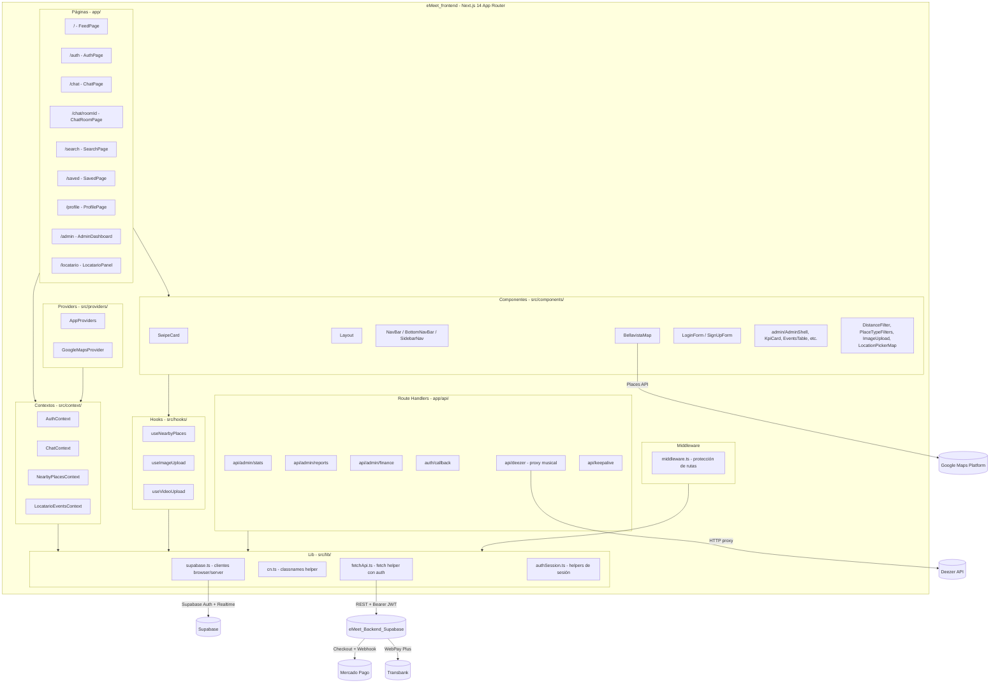
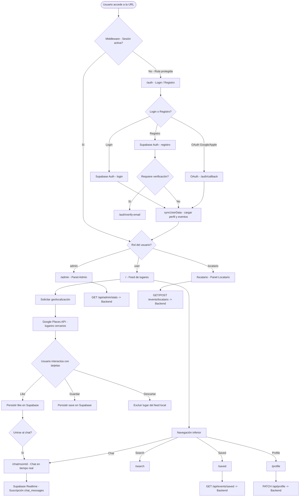
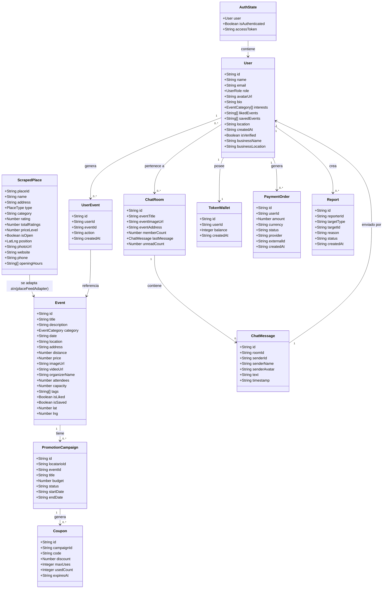

# Diagramas UML — Proyecto eMeet

> Todos los diagramas están representados en formato **Mermaid** y se basan en el análisis real de ambos repositorios (`eMeet_frontend` y `eMeet_Backend_Supabase`) confirmado en el Informe EP2 del proyecto.

---

## 1. Diagrama de Casos de Uso

```mermaid
flowchart TD
    U([Usuario Regular])
    L([Locatario])
    A([Administrador])
    SYS[[Sistema eMeet]]

    U -->|Registrarse / Iniciar sesión| SYS
    U -->|Explorar feed de lugares| SYS
    U -->|Dar like a un lugar| SYS
    U -->|Guardar un lugar| SYS
    U -->|Ver lugares guardados| SYS
    U -->|Buscar y filtrar lugares| SYS
    U -->|Unirse a sala de chat| SYS
    U -->|Enviar mensajes en chat| SYS
    U -->|Ver mensajes en tiempo real| SYS
    U -->|Editar perfil e intereses| SYS
    U -->|Cerrar sesión| SYS

    L -->|Registrarse como locatario| SYS
    L -->|Crear evento propio| SYS
    L -->|Eliminar evento propio| SYS
    L -->|Ver mis eventos publicados| SYS
    L -->|Comprar tokens| SYS
    L -->|Crear campaña de promoción| SYS
    L -->|Generar cupón QR| SYS
    L -->|Validar cupón QR| SYS
    L -->|Ver analíticos del negocio| SYS
    L -->|Pagar con Mercado Pago / Transbank| SYS

    A -->|Ver dashboard y KPIs| SYS
    A -->|Gestionar usuarios| SYS
    A -->|Gestionar eventos publicados| SYS
    A -->|Moderar contenido y reportes| SYS
    A -->|Resolver reportes de usuarios| SYS
    A -->|Gestionar transacciones financieras| SYS
    A -->|Banear usuario o evento| SYS
    A -->|Ver estadísticas financieras| SYS

    SYS -->|Supabase Auth| SA[(Supabase Auth)]
    SYS -->|Google Places API| GP[(Google Places)]
    SYS -->|Supabase Realtime| RT[(Supabase Realtime)]
    SYS -->|eMeet_Backend_Supabase| BE[(Backend API REST)]
    SYS -->|Checkout + Webhook| MP[(Mercado Pago)]
    SYS -->|WebPay Plus| TB[(Transbank)]
    SYS -->|Proxy musical| DZ[(Deezer API)]
```

---

## 2. Diagrama de Componentes

---

## 3. Diagrama de Flujo General de la Aplicación

---

## 4. Diagrama de Clases Conceptual

---

## 5. Notas sobre los Diagramas

- Los diagramas representan el estado actual del proyecto según el análisis de ambos repositorios (`eMeet_frontend` y `eMeet_Backend_Supabase`) y el Informe EP2.
- El backend Express (`eMeet_Backend_Supabase`) expone 7 grupos de rutas: `/auth`, `/profile`, `/events`, `/chat`, `/places`, `/admin`, `/monetization`.
- Las tablas de Supabase confirmadas son 14 en total: `profiles`, `user_events`, `chat_rooms`, `room_members`, `chat_messages`, `locatario_events`, `token_wallets`, `token_transactions`, `payment_orders`, `promotion_campaigns`, `coupons`, `transactions`, `reports`, `qr_validations`.
- La clase `ScrapedPlace` representa los datos obtenidos desde Google Places API y se transforma en objetos `Event` mediante el adaptador `src/data/placeFeedAdapter.ts`.
- Los Route Handlers `app/api/admin/*` usan Service Role Key de Supabase y no son una capa BFF — solo gestionan operaciones administrativas y el proxy de Deezer.
- La integración de pagos (Mercado Pago y Transbank) se realiza desde el backend Express, no desde el frontend.
